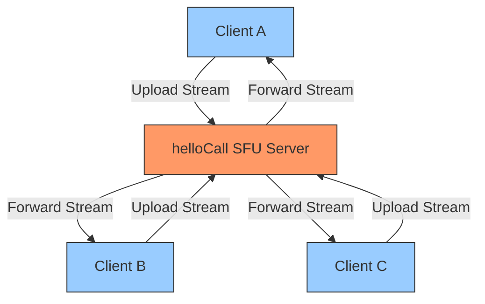
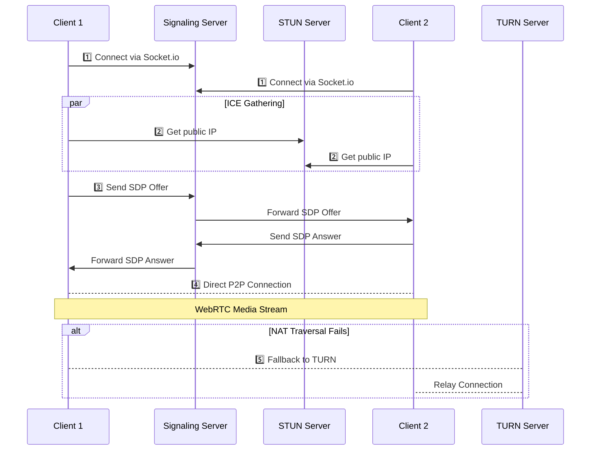

# 🎥 helloCall

## 🧾 About

**helloCall** is a lightweight, multi-party video chat application built with **React, WebRTC, PeerJS, and Socket.io**. It allows real-time video and audio communication between users in a room, using a **local signaling server built with Express**, making it **SFU-ready**.

This project demonstrates WebRTC concepts, NAT traversal with ICE, SFU-based media forwarding, and client-side management of peer streams using React context and reducers.

---

## 🧰 Tech Stack

- **Frontend:** React, TypeScript, TailwindCSS
- **WebRTC:** PeerJS for peer-to-peer media streaming
- **Signaling Server:** Express + Socket.io
- **State Management:** React Context + Reducer pattern
- **UUIDs:** `uuid` for generating unique room and peer IDs

---

## 🗂 Folder Structure

```
helloCall/
├── README.md
├── client/                     # React frontend
│   ├── README.md
│   ├── eslint.config.js
│   ├── index.html
│   ├── node_modules/
│   ├── package-lock.json
│   ├── package.json
│   ├── postcss.config.js
│   ├── public/                 # Public assets
│   ├── src/                    # Source code
│   │   ├── App.css
│   │   ├── App.tsx
│   │   ├── actions/            # Redux or state actions
│   │   ├── assets/             # Images, icons, etc.
│   │   ├── components/         # React components
│   │   ├── context/            # React context & reducers
│   │   ├── index.css
│   │   ├── main.tsx
│   │   ├── pages/              # Page-level components
│   │   └── reduces/            # Reducer files
│   ├── tailwind.config.js
│   ├── tsconfig.app.json
│   ├── tsconfig.json
│   ├── tsconfig.node.json
│   └── vite.config.ts
├── node_modules/               # Root dependencies
│   └── @types/
└── server/                     # Backend server
    ├── combined.log
    ├── dist/                   # Compiled output
    ├── node_modules/
    ├── package-lock.json
    ├── package.json
    ├── src/                    # Server source code
    │   ├── config/             # Configuration files
    │   ├── handlers/           # Request/response handlers
    │   ├── index.ts            # Main server entry
    │   └── interfaces/         # TypeScript interfaces
    ├── tsconfig.json
    └── tslint.json

```

### Notes:

- `client/` contains **all frontend logic**, including components, state management, and custom hooks.
- `server/` contains the **Express + Socket.io signaling server**.

---

## ✅ Core Features

### 1. Multi-Party Video Chat

- Create or join rooms instantly.
- Real-time video/audio streaming.
- Each client uploads **one outgoing stream** and receives streams from others.
- Scales efficiently with **SFU architecture**.

### 2. SFU Architecture

- SFU (Selective Forwarding Unit) **forwards media streams** to all clients except the sender.
- Ensures each client uploads only **one stream**, regardless of participant count.



Each client in **helloCall** captures its local media stream (camera and microphone) and uploads it to the **SFU server**.  
The SFU acts as a **media router**, not a mixer — it receives each user’s incoming stream and **selectively forwards** it to all other connected clients in the same room.

This design ensures that:

- 💡 Every participant **uploads only one stream**, reducing upstream bandwidth usage.
- ⚙️ The SFU handles **efficient distribution** of streams to all peers.
- 📈 The architecture scales better than full-mesh (P2P-to-everyone) models.
- 🎥 Clients receive multiple incoming streams — one from each other participant — while maintaining smooth real-time performance.

In essence, **helloCall** implements a **lightweight SFU-style WebRTC architecture** where the **Express + Socket.io** signaling layer coordinates connections,  
and **PeerJS** handles the actual media exchange between peers through this forwarding mechanism.

---

### 3. WebRTC Connection Flow



The connection flow in helloCall follows standard WebRTC practices:

1. Clients connect to the signaling server via Socket.io
2. Both clients discover their public IP addresses using STUN servers
3. They exchange SDP (Session Description Protocol) offers and answers through the signaling server
4. A direct peer-to-peer connection is established for media streaming
5. If NAT traversal fails, the connection falls back to TURN server relay

This ensures reliable connectivity across different network configurations while prioritizing direct P2P connections when possible.

---

## 🏁 Conclusion

helloCall demonstrates a practical, lightweight SFU-style WebRTC architecture that prioritizes direct P2P connections. It’s designed for clarity, extensibility, and real-time performance in multi-party video scenarios.

---
